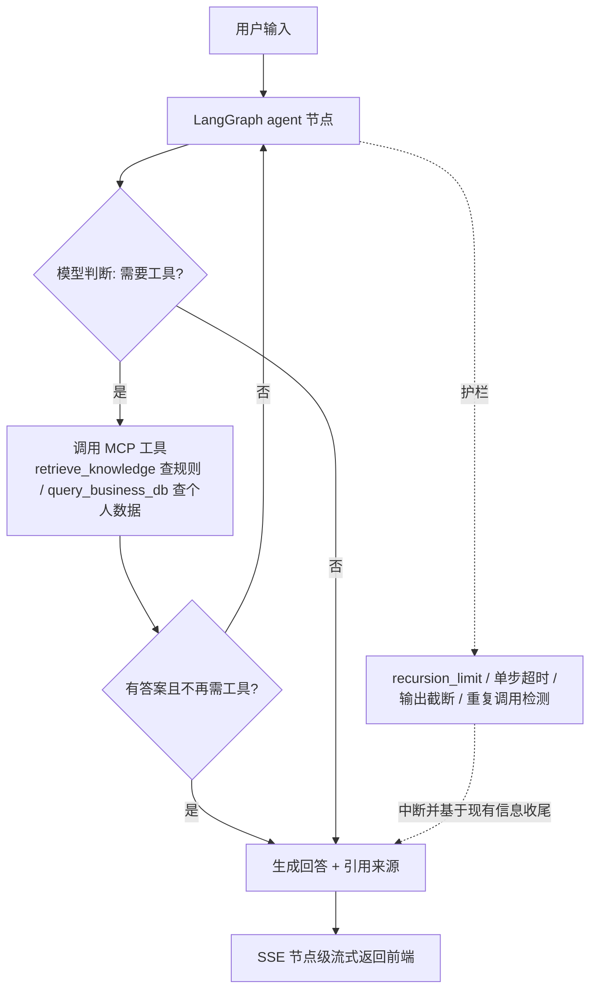

# kbase-agent

**企业知识库 + 工具调用 Agent（单 Agent）**：基于 LangGraph 的 ReAct 式工具循环，RAG 检索与业务工具经 **MCP 协议真接入**（stdio）；配**两层评测 Harness**（40 条金标：检索层 + 端到端回归）、SQLite 会话持久化、trace/成本可观测与护栏。求职学习项目的旗舰作品。

> **与姊妹项目 `mcp-tools` 的关系**（两仓库是**一个系统的两层**，不是两个重复 demo）：
> 本仓库是**编排层**——Agent 怎么决策、怎么检索、怎么管状态、怎么评测；
> `mcp-tools` 是**协议层**——把工具按 MCP 标准做成"可被任何客户端消费"的 Server（安全边界在其内部）。
> 本项目的工具用 FastMCP 写在 `app/mcp/servers.py`，走真 stdio 子进程；`mcp-tools` 则刻意换成
> 数据/文件域、并只保留 stdio，用来独立验证"工具与 Agent 解耦、跨客户端复用"这件事本身。
> 面试口径：**编排与协议分层**，不是"做了两个知识库问答"。

## 目录结构

```
app/
  config.py            # 环境配置（DeepSeek 主，OpenAI 兼容层模型无关）
  main.py              # FastAPI 入口（懒加载资源）
  services.py          # 检索管道 + Agent runtime 懒加载与进程内缓存
  store.py             # 会话/消息记录 + run_traces 观测表（读历史/观测接口数据源）
  observability.py     # 轻量 trace：节点耗时/token/成本（contextvars，不侵入 LangGraph state）
  api/
    chat.py            # 请求/响应模型(内联) + POST /chat（同步）+ POST /chat/stream（SSE 节点级流式）
  retrieval/
    loader.py          # 文档解析 md/txt/docx/xlsx/pdf（文本层抽取，_ 前缀忽略）
    chunker.py         # fixed vs recursive 切分
    embedder.py        # 默认 FastEmbed(ONNX 免 torch)，可切 bge-m3
    vector_store.py    # Chroma（开发；生产可换 Milvus/ES）
    keyword.py         # BM25 关键词索引（纯 Python）
    hybrid.py          # 向量 + BM25 走 RRF 合并 + 可选 rerank
    pipeline.py        # 装配入口：index / retrieve / 懒加载
  agent/
    graph.py           # AgentState(内联) + LangGraph StateGraph + LLM 工厂(make_llm) + SqliteSaver(checkpoint) + 护栏 + MCP 接线
  mcp/
    servers.py         # FastMCP：retrieve_knowledge / query_business_db（HR 个人数据）
  guardrails.py        # 轮次/超时/工具输出截断/重复调用检测
  data/
    docs/                # 知识库语料：9 篇（6 篇 md + docx/xlsx/pdf 各 1），统一分块入库（_ 前缀忽略）
    business/            # 业务系统个人数据（首次调用自动生成示例）
    checkpoints.sqlite   # 会话 checkpoint + 消息记录（自动生成；.gitignore 已忽略 *.sqlite）
eval/                  # 40 条评测集 + 指标（跑分脚本在 scripts/eval.py、scripts/eval_e2e.py）
scripts/               # index_docs.py / eval.py / eval_e2e.py / demo_agent.py
static/                # 单文件演示前端（index.html，无构建，打开即聊）
tests/                 # smoke + 纯逻辑单测（19 项）
start.bat / start.ps1  # Windows 一键启动（建 venv → 装依赖 → 建索引 → 起服务）
requirements.lock      # 已验证可跑的依赖组合（langgraph 1.2.x / langchain-core 1.6.x，Python 3.12）
docs/
  eval-reports/        # 评测报告（baseline.json 基线 + fullrun-verify.json 复核，可被 --compare 引用）
  screenshots/         # 演示截图
```

## 快速开始

**一键启动（推荐）**：进入 `kbase-agent` 目录，双击 `start.bat`（Windows），或运行 `./start.ps1`。
脚本会自动完成：检查/创建 `.venv` → 缺依赖时安装 → 生成 `.env`（仍占位则提示你填 key）→ 缺索引时自动建库 → 启动服务并打开 http://127.0.0.1:8000。`Ctrl+C` 停止。

手动步骤（等价，想看清每步时用）：

```bash
cd kbase-agent
python -m venv .venv
.venv\Scripts\activate          # Windows；macOS/Linux 用 source .venv/bin/activate
pip install -r requirements.lock   # 可选但推荐：复现已验证的依赖组合（Python 3.12）
pip install -e ".[dev]"         # 默认零 torch；重排/bge-m3 才需要 .[embed]
copy .env.example .env          # 填入 DEEPSEEK_API_KEY
uvicorn app.main:app --reload   # http://127.0.0.1:8000/docs
```

> **依赖为什么要锁**：上游 `langgraph` / `langchain-core` / `chromadb` 大版本变动快，本仓库实测可跑的
> 组合是 **langgraph 1.2.x + langchain-core 1.6.x + chromadb 1.5.x**（见 `requirements.lock` 头部）。
> 只跑 `pip install -e .` 可能装到不兼容的新版本——先装 lock、再装本包，是最稳的顺序。

## 使用

```bash
python scripts/index_docs.py                     # 建索引（首次会下载 ~几十MB ONNX embedding）
python scripts/eval.py                           # 跑 40 条评测（命中率/引用准确率，离线零成本）
python scripts/eval_e2e.py --reanalyze           # 只重算已有报告的指标（含 p50/p95），不调 API
python scripts/demo_agent.py "张三还剩几天年假？"  # 命令行跑一遍完整 Agent
python scripts/eval_e2e.py --limit 5     # 端到端回归（真实调 API，判回答/引用/成本）
```

> 前三条（建索引、检索层评测、报告重算）**不需要 API key**；只有 Agent 对话与端到端评测需要。
> `--reanalyze` 是纯离线分析：per-case 里已存着 duration_ms/token/cost 明细，指标口径变化不必重花钱重跑。

网页对话：启动服务后浏览器打开 **http://127.0.0.1:8000** 即聊（`static/index.html` 单文件页面，无构建、无依赖）。页面走 **SSE 节点级流式（`/api/chat/stream`）**，提问后可见 Agent 逐步工具调用（检索→查库）与最终回答。左侧会话栏可**新建 / 回看 / 切换历史会话**：消息与 checkpoint 落 `data/checkpoints.sqlite`，刷新页面甚至重启服务后仍能恢复并继续对话。

API：
- `GET /api/health`：存活探针，**不依赖 key / 索引**——503 排查时先打它，能区分"服务没起来"和"Agent 引擎没就绪"。
- `POST /api/chat`：同步返回 `{answer, sources}`。
- `POST /api/chat/stream`：SSE 逐步下发节点增量，`done` 事件带最终答案与来源。
- `GET /api/sessions` / `GET /api/sessions/{session_id}/messages`：读会话列表与历史消息（给前端"历史会话"用）。
- `GET /api/runs` / `GET /api/runs/{id}`：运行 trace（耗时/token/成本/错误 + 节点级 steps），可观测用。
- 请求体：`{messages:[{role,content}], session_id?}`。**同一 session 请只追加最新一条消息**（LangGraph 按 thread 自动拼历史，避免重复）。
- **会话持久化**：Agent checkpoint（AsyncSqliteSaver）与消息记录共用 `data/checkpoints.sqlite`（WAL），**服务重启可续聊、历史可读**。

示例对话：问"我今年还剩几天年假？按手册能结转吗？"——Agent 会先 `retrieve_knowledge` 拿《员工手册》结转规则，再 `query_business_db` 拿张三个人剩余天数，两条来源结合作答，末尾列引用。

## 演示截图

网页对话（多轮、含引用来源）：


## 效果度量（简历口径）

`eval/questions.jsonl` 每条含 `expected_source`（40 条、id 1~40 不重复；真值来源全部是 `data/docs/` 里实际存在的 9 篇文件名）：
- `scripts/eval.py`（检索层，离线零成本）：`topk_hit_rate` 是否命中正确来源。同一脚本里的 `citation_accuracy` 与它是同一个判定（都看 top-k 来源里有没有真值文件），两个数字不会不同——别当成两个指标讲。
- `scripts/eval_e2e.py`（端到端，真实调 Agent API）：统计回答率（**只判非空**）、引用覆盖（真值来源是否出现在**本轮工具返回的 sources** 里，不判答案文本里有没有引用）、耗时与成本——用于 prompt/模型/工具改动后的回归把关。指标含 `p50_duration_ms` / `p95_duration_ms`（线性插值分位数，口径与 numpy 默认一致），是"单次问答端到端耗时"，**含 MCP 子进程启动 + 检索 + LLM 往返**。

40 条是回归冒烟集，不是统计评测；简历别写百分比，写"离线回归集 + 可视化坏例调参"。

**两份入库报告的实测数字**（`docs/eval-reports/`，同口径可复算）：

| 报告 | tag / 时间 | answer_rate | citation_accuracy | p50 延迟 | p95 延迟 | 总成本 |
|---|---|---|---|---|---|---|
| `baseline.json` | baseline / 2026-09-07 | 40/40 = 1.0 | 40/40 = 1.0 | 7420 ms | 12368 ms | ¥0.2927 |
| `fullrun-verify.json` | fullrun-verify / 2026-09-13 | 40/40 = 1.0 | 40/40 = 1.0 | 7497 ms | 12975 ms | ¥0.3020 |

**这两组数字要会自己解释**（否则会被追问穿）：两次 `citation_accuracy` 都是 1.0、`--compare` 报"无逐条变化"，说明**该集合当前没有区分度**——它的价值是"防劣化的回归基线"，不是"效果有多好"的证明。延迟 p50 ≈ 7.4s / p95 ≈ 12.5s，且两次跑之间 p95 就有 ~600ms 抖动，**主要成本是每条都新起 stdio 子进程 + 真实 LLM 往返**，这也是本项目最该优化的工程点（见「已知取舍」）。

**口径边界（别被追问才想起来）**：40 条都是**单轮**提问（每条走新 thread，不共享上下文），所以**多轮行为不在评测覆盖内**。同一 session 续聊时历史会累积，模型可能直接基于上下文作答而**不再调工具**，该轮 `sources` 因此为空——引用只统计**本轮**工具返回，历史轮次的来源不会带过来（`data/business` 个人数据工具输出也不含【来源：】标记，本来就不贡献 sources）。

## Agent 决策流程



## 面试可讲点

- **框架**：LangGraph 有状态图、SQLite 断点续聊（AsyncSqliteSaver + WAL，重启不丢会话；高并发生产可换 Postgres）；AutoGen 并入 Microsoft Agent Framework 后我以 LangGraph 为主线。
- **MCP**：工具经 `langchain-mcp-adapters` 以真 MCP（stdio 子进程）接入，不是手写 function calling 的装饰——工具与编排解耦，天然可跨语言复用。
- **RAG**：混合检索（向量 + BM25 做 RRF）去抖 + 可选重排 + 引用溯源 + 评测集验证，坏例能说清怎么调好的。
- **工程化**：SSE 节点级流式、护栏（死循环/超时/上下文截断/重复调用）、懒加载与多轮状态管理。
- **效果与成本**：40 条金标两层 Harness（`--tag` 落报告、`--compare` 回归 diff、`--reanalyze` 离线重算指标）；延迟 p50 ≈ 7.4s / p95 ≈ 12.5s、单条成本 ≈ ¥0.0075，`/api/runs` 有节点级 trace 可逐条归因（**延迟大头是每条新起 MCP stdio 子进程 + LLM 往返**，不是检索）。

## 对标 JD 主要能力（面试话术）

| JD 共性要求 | 本项目对应 | 说明 |
|---|---|---|
| 标准化评估闭环 | 40 条金标集 + 两层 Harness | `eval.py` 检索层（离线零成本）+ `eval_e2e.py` Agent 层（`--tag` 落报告、`--compare` 回归 diff，指标含回答率/引用覆盖/成本） |
| Agent 架构与工具调用 | **单 Agent** ReAct 式工具循环 + MCP 工具层 | LangGraph `agent→tools` 条件边做工具路由；决策在模型、编排在框架；多 Agent/Skills 为下一阶段方向（**未实现，不宣称**） |
| 工程化与生产落地 | 上下文管理 / 工具失效处理 / 持久化 / 可观测 | 工具输出截断、重复工具调用判重（窗口=单次运行内 25 步）防死循环、超时异常结构化回填、checkpoint 断点续聊（SQLite）、trace/成本/历史会话 |
| 权限与重试降级 | 见"已知取舍"（生产化方向） | 按用户区分权限、工具失败重试/降级列为生产化改进，**未实现不宣称** |

## 容器化部署设计（**未实施**，方案已想清）

> 说明：本仓库**目前没有 Dockerfile**，下面是把容器化想清楚后的设计，不是已完成能力。
> 之所以先写设计：面试被问"你会怎么容器化"时，答的是这些判断点（尤其第 2、3 条），
> 而不是"我还没做"。真正实施时按此落地并补一份实测记录。

1. **基础镜像与依赖**：`python:3.12-slim` + `pip install -r requirements.lock`（本仓库已锁版本，正好是这里的输入）→ 再 `pip install -e .`。
   `onnxruntime`（FastEmbed 底层）在 slim 上需要补系统库（如 `libgomp1`）；这是个真实的踩坑点，装完要验证 `import onnxruntime`。
2. **模型与索引放哪（唯一真正需要判断的点）**——两者策略相反：
   - **embedding 模型**：构建期预热进镜像（`RUN python -c "from fastembed import TextEmbedding; ..."`）→ 启动快、可离线，代价是镜像大几百 MB；
     若追求小镜像则改成挂缓存卷，但首次启动必须联网下载。
   - **索引与会话数据必须挂卷**：`data/chroma/`（索引）、`data/checkpoints.sqlite`（会话）、`data/business/`（业务数据）
     三者都是"运行期产生、不能随镜像重建清掉"的状态。
3. **有状态 → 副本数受限**：checkpoint 是 SQLite 文件，所以**单副本 + 卷**即可；
   要横向扩必须先换 Postgres checkpointer（见本文「已知取舍」），否则多副本各写各的会话。
4. **健康检查**：`HEALTHCHECK` 直接打 `/api/health`——该探针刻意做成**不依赖 API key 与索引**，
   这正是 liveness / readiness 该有的语义（容器起来但引擎未就绪时可被区分）。
5. **密钥与配置**：key 由 `-e` / secrets 注入，**绝不写进镜像层**；`.env` 必须进 `.dockerignore`。

**同时要清楚容器化解决不了什么**：鉴权、限流、多副本调度、结构化日志与指标导出、CI/CD 与回滚——
这些属于"工程化部署"的其余环节，本仓库均未做（同样不宣称）。容器化只拿到"打包与环境可复现"这一格。

## 已知取舍 / 改进方向

- 开发用 Chroma，生产切 Milvus / Elasticsearch（换 collection 层即可）。
- 默认 FastEmbed（ONNX，零 torch）；要更准可 `EMBED_BACKEND=flagembedding` 上 bge-m3，或 `RERANK_ENABLED=true` 加重排——均需 `pip install -e ".[embed]"`。**换 embedding 后删除 `data/chroma/` 重建索引**。
- 切分实现 fixed vs recursive 对比；语义 / 父子分块列为改进方向。
- DeepSeek 默认，`.env` 两行即可切 GLM / Qwen。
- `MAX_RECURSION` + prompt 第 5 条 `max_steps` + 重复调用检测 = 三道防死循环。
- 解析层支持 `.md/.txt/.docx/.xlsx/.pdf`（统一抽成纯文本/表格文本）；扫描件/图片类 PDF 无文本层，需 OCR，列为扩展。**替换已有同名文档后请删 `data/chroma/` 重建索引**（增量新增文件可直接 `python scripts/index_docs.py`）。
- 会话 checkpoint 落 SQLite（`data/checkpoints.sqlite`，WAL）：Agent 状态与消息记录分离（checkpoint 表 vs conversations/messages + run_traces）；重启不丢、同一 session 续聊。多进程/高并发生产换 Postgres 并加按用户区分与消息分库。成本估算为估算值（单价见 `.env` 的 `LLM_PRICE_*`）。
- 同一 session 的**并发**请求未做串行保护：LangGraph 状态按 `thread_id` 记，同 thread 并发属"后写覆盖"（多路并发不会报错，但两轮谁先落地不保证）。生产化需按 session 串行或进队列。
- 多轮对话历史目前全量进上下文（checkpoint 保存全量消息）；超长会话建议后续加历史压缩/裁剪（如 summarize 节点或 max_turns 截断），列为方向。
- 架构边界明确：当前是**单 Agent + MCP 工具层**；多 Agent 编排 / Skills / 工具失败重试与降级 / prompt 注入防护 是后续方向——面试可主动讲思路，但不写进"已完成"能力。

## 常见坑

- **Anaconda 下 onnxruntime 报 `DLL load failed`**：是 Anaconda 自带旧版 VC 运行库（vcruntime140/msvcp140≈14.29）盖过了系统新版。执行 `conda update -n base -c conda-forge -y vs2015_runtime` 一次即可（torch/bge 同理会遇到）。
- 首次跑 `scripts/index_docs.py` 会从 HuggingFace 下载 embedding 模型（几十 MB）；换模型后务必删 `data/chroma/`。
- 每个 MCP 工具调用都会新起一个 stdio 子进程（真 MCP 的代价）；演示规模无所谓，要提速可把 `app/mcp/servers.py` 改成进程内直连。**这是当前 p95 延迟的主要来源**（`--compare` 两次跑的 p95 就差了 ~600ms，抖动也来自子进程启动与 LLM 往返）。

