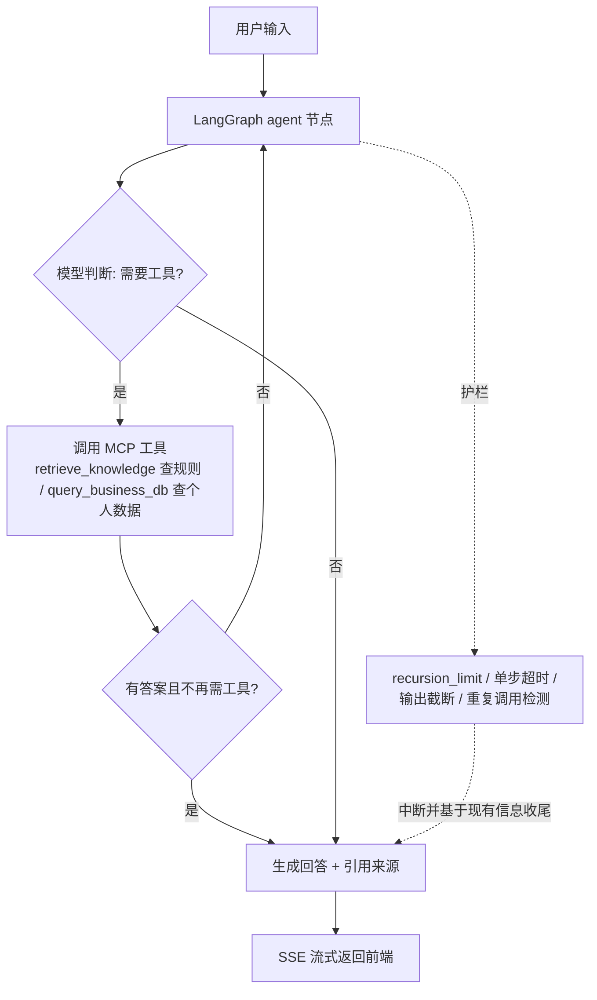

# kbase-agent

**企业知识库 + 工具调用 Agent**：基于 LangGraph 构建有状态 Agent，RAG 检索与业务工具经 **MCP 协议真接入**（`langchain-mcp-adapters` + stdio），支持流式输出、会话持久化与护栏。求职学习项目的旗舰作品。

## 目录结构

```
app/
  config.py            # 环境配置（DeepSeek 主，OpenAI 兼容层模型无关）
  llm.py               # ChatOpenAI -> DeepSeek
  main.py              # FastAPI 入口（懒加载资源）
  services.py          # 检索管道 + Agent runtime 懒加载与进程内缓存
  api/
    schemas.py         # 请求/响应模型
    chat.py            # POST /chat（同步） + POST /chat/stream（SSE 流式）
  retrieval/
    loader.py          # 文档解析（data/docs）
    chunker.py         # fixed vs recursive 切分
    embedder.py        # 默认 FastEmbed(ONNX 免 torch)，可切 bge-m3
    vector_store.py    # Chroma（开发；生产可换 Milvus/ES）
    keyword.py         # BM25 关键词索引（纯 Python）
    hybrid.py          # 向量 + BM25 走 RRF 合并 + 可选 rerank
    pipeline.py        # 装配入口：index / retrieve / 懒加载
  agent/
    state.py           # AgentState（messages 用 Annotated reducer）
    graph.py           # LangGraph StateGraph + MemorySaver + 护栏 + MCP 接线
  mcp/
    servers.py         # FastMCP：retrieve_knowledge / query_business_db（HR 个人数据）
  guardrails.py        # 轮次/超时/工具输出截断/重复调用检测
data/
  docs/                # 知识库原始文档（员工手册 / 产品 FAQ）
  business/            # 业务系统个人数据（首次调用自动生成示例）
eval/                  # 10 条评测集 + 指标（top-k 命中率 / 引用准确率）
scripts/               # index_docs.py / eval.py / demo_agent.py
static/                # 单文件演示前端（index.html，无构建，打开即聊）
tests/                 # smoke + 纯逻辑单测
```

## 快速开始

```bash
cd kbase-agent
python -m venv .venv
.venv\Scripts\activate          # Windows；macOS/Linux 用 source .venv/bin/activate
pip install -e ".[dev]"         # 默认零 torch；重排/bge-m3 才需要 .[embed]
copy .env.example .env          # 填入 DEEPSEEK_API_KEY
uvicorn app.main:app --reload   # http://127.0.0.1:8000/docs
```

## 使用

```bash
python scripts/index_docs.py                     # 建索引（首次会下载 ~几十MB ONNX embedding）
python scripts/eval.py                           # 跑 10 条评测（命中率/引用准确率）
python scripts/demo_agent.py "张三还剩几天年假？"  # 命令行跑一遍完整 Agent
```

网页对话：启动服务后浏览器打开 **http://127.0.0.1:8000** 即聊（`static/index.html` 单文件页面，无构建、无依赖；同一页面会维持一个 session，支持多轮上下文）。

API 两个端点（服务首次收到对话请求会自动建索引并拉起 MCP 子进程）：
- `POST /api/chat`：同步返回 `{answer, sources}`。
- `POST /api/chat/stream`：SSE 逐步下发节点增量，`done` 事件带最终答案与来源。
- 请求体：`{messages:[{role,content}], session_id?}`。**同一 session 请只追加最新一条消息**（LangGraph 按 thread 自动拼历史，避免重复）。

示例对话：问"我今年还剩几天年假？按手册能结转吗？"——Agent 会先 `retrieve_knowledge` 拿《员工手册》结转规则，再 `query_business_db` 拿张三个人剩余天数，两条来源结合作答，末尾列引用。

## 效果度量（简历口径）

`eval/questions.jsonl` 每条含 `expected_source`，`scripts/eval.py` 输出：
- `topk_hit_rate`：检索 top-k 是否命中正确来源（是"命中率"不是 recall，口径注意）。
- `citation_accuracy`：返回来源是否覆盖真值来源。

10 条是回归冒烟集，不是统计评测；简历别写百分比，写"离线回归集 + 可视化坏例调参"。

## Agent 决策流程



## 面试可讲点

- **框架**：LangGraph 有状态图、MemorySaver 断点续聊（生产换 Sqlite/Postgres）；AutoGen 并入 Microsoft Agent Framework 后我以 LangGraph 为主线。
- **MCP**：工具经 `langchain-mcp-adapters` 以真 MCP（stdio 子进程）接入，不是手写 function calling 的装饰——工具与编排解耦，天然可跨语言复用。
- **RAG**：混合检索（向量 + BM25 做 RRF）去抖 + 可选重排 + 引用溯源 + 评测集验证，坏例能说清怎么调好的。
- **工程化**：SSE 流式、护栏（死循环/超时/上下文截断/重复调用）、懒加载、成本与 trace。

## 已知取舍 / 改进方向

- 开发用 Chroma，生产切 Milvus / Elasticsearch（换 collection 层即可）。
- 默认 FastEmbed（ONNX，零 torch）；要更准可 `EMBED_BACKEND=flagembedding` 上 bge-m3，或 `RERANK_ENABLED=true` 加重排——均需 `pip install -e ".[embed]"`。**换 embedding 后删除 `data/chroma/` 重建索引**。
- 切分实现 fixed vs recursive 对比；语义 / 父子分块列为改进方向。
- DeepSeek 默认，`.env` 两行即可切 GLM / Qwen。
- `MAX_RECURSION` + prompt 内 `max_iterations` + 重复调用检测 = 三道防死循环。

## 常见坑

- **Anaconda 下 onnxruntime 报 `DLL load failed`**：是 Anaconda 自带旧版 VC 运行库（vcruntime140/msvcp140≈14.29）盖过了系统新版。执行 `conda update -n base -c conda-forge -y vs2015_runtime` 一次即可（torch/bge 同理会遇到）。
- 首次跑 `scripts/index_docs.py` 会从 HuggingFace 下载 embedding 模型（几十 MB）；换模型后务必删 `data/chroma/`。
- 每个 MCP 工具调用都会新起一个 stdio 子进程（真 MCP 的代价）；演示规模无所谓，要提速可把 `app/mcp/servers.py` 改成进程内直连。

