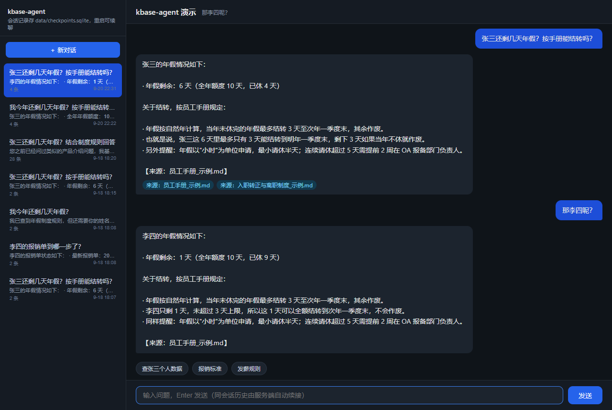
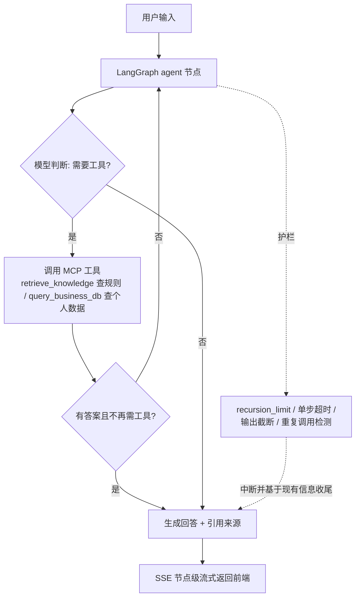

# kbase-agent

**企业知识库 + 工具调用 Agent（单 Agent）**：基于 LangGraph 的 ReAct 式工具循环，RAG 检索与业务工具经 **MCP 协议真接入**（stdio）；配**两层评测 Harness**（60 条金标：检索层 + 端到端回归，含多跳/冲突/应拒答三类难例）、SQLite 会话持久化、trace/成本可观测与护栏。

> **与姊妹项目 `mcp-tools` 的关系**（两仓库是**一个系统的两层**，不是两个重复 demo）：
> 本仓库是**编排层**——Agent 怎么决策、怎么检索、怎么管状态、怎么评测；
> `mcp-tools` 是**协议层**——把工具按 MCP 标准做成"可被任何客户端消费"的 Server（安全边界在其内部）。
> 本项目的工具用 FastMCP 写在 `app/mcp/servers.py`，走真 stdio 子进程；`mcp-tools` 则刻意换成
> 数据/文件域、并只保留 stdio，用来独立验证"工具与 Agent 解耦、跨客户端复用"这件事本身。
> 两者合起来是**编排 + 协议分层**，而不是"做了两个知识库问答"。

## 目录结构

```
app/
  config.py            # 环境配置（DeepSeek 主，OpenAI 兼容层模型无关）
  main.py              # FastAPI 入口（懒加载资源）
  services.py          # 检索管道 + Agent runtime 懒加载与进程内缓存
  store.py             # 会话/消息记录 + run_traces 观测表（读历史/观测接口数据源）
  observability.py     # 轻量 trace：节点耗时/token/成本（contextvars，不侵入 LangGraph state）
  api/
    chat.py            # 请求/响应模型(内联) + POST /chat（同步）+ POST /chat/stream（SSE 节点级流式）
  retrieval/
    loader.py          # 文档解析 md/txt/docx/xlsx/pdf（文本层抽取，_ 前缀忽略）
    chunker.py         # fixed vs recursive 切分
    embedder.py        # 默认 FastEmbed(ONNX 免 torch)，可切 bge-m3
    vector_store.py    # Chroma（开发；生产可换 Milvus/ES）
    keyword.py         # BM25 关键词索引（纯 Python）
    hybrid.py          # 向量 + BM25 走 RRF 合并 + 可选 rerank
    pipeline.py        # 装配入口：index / retrieve / 懒加载
  agent/
    graph.py           # AgentState(内联) + LangGraph StateGraph + LLM 工厂(make_llm) + SqliteSaver(checkpoint) + 护栏 + MCP 接线
  mcp/
    servers.py         # FastMCP：retrieve_knowledge / query_business_db（HR 个人数据）
  guardrails.py        # 轮次/超时/工具输出截断/重复调用检测
  data/
    docs/                # 知识库语料：39 篇合成企业制度/FAQ（含 docx/xlsx/pdf 三种格式样例），统一分块入库（_ 前缀忽略）
    business/            # 业务系统个人数据（首次调用自动生成示例）
    checkpoints.sqlite   # 会话 checkpoint + 消息记录（自动生成；.gitignore 已忽略 *.sqlite）
eval/                  # 60 条评测集（含多跳/冲突/应拒答）+ 指标（跑分脚本在 scripts/eval.py、scripts/eval_e2e.py）
scripts/               # index_docs.py / eval.py / eval_e2e.py / demo_agent.py
static/                # 单文件演示前端（index.html，无构建，打开即聊）
tests/                 # smoke + 纯逻辑单测（77 项，`pytest` 实测 77 passed）
start.bat / start.ps1  # Windows 一键启动（建 venv → 装依赖 → 建索引 → 起服务）
requirements.lock      # 已验证可跑的依赖组合（langgraph 1.2.x / langchain-core 1.6.x，Python 3.12）
docs/
  eval-reports/        # 评测报告（baseline.json 基线 + fullrun-verify.json 复核，可被 --compare 引用）
  screenshots/         # 演示截图
```

## 快速开始

**一键启动（推荐）**：进入 `kbase-agent` 目录，双击 `start.bat`（Windows），或运行 `./start.ps1`。
脚本会自动完成：检查/创建 `.venv` → 缺依赖时安装 → 生成 `.env`（仍占位则提示你填 key）→ 缺索引时自动建库 → 启动服务并打开 http://127.0.0.1:8000。`Ctrl+C` 停止。

手动步骤（等价，想看清每步时用）：

```bash
cd kbase-agent
python -m venv .venv
.venv\Scripts\activate          # Windows；macOS/Linux 用 source .venv/bin/activate
pip install -r requirements.lock   # 可选但推荐：复现已验证的依赖组合（Python 3.12）
pip install -e ".[dev]"         # 默认零 torch；重排/bge-m3 才需要 .[embed]
copy .env.example .env          # 填入 DEEPSEEK_API_KEY
uvicorn app.main:app --reload   # http://127.0.0.1:8000/docs
```

> 建索引前建议保留 `.env.example` 里的 `FASTEMBED_CACHE_DIR=./data/fastembed_cache`：
> 不设时 FastEmbed 会把模型权重下到 `%TEMP%\fastembed_cache`，而临时目录会被清理工具删掉——
> 删掉后"索引还在、模型没了"，必须重新联网下载（见「常见坑」）。

> **依赖为什么要锁**：上游 `langgraph` / `langchain-core` / `chromadb` 大版本变动快，本仓库实测可跑的
> 组合是 **langgraph 1.2.x + langchain-core 1.6.x + chromadb 1.5.x**（见 `requirements.lock` 头部）。
> 只跑 `pip install -e .` 可能装到不兼容的新版本——先装 lock、再装本包，是最稳的顺序。

## 使用

```bash
python scripts/index_docs.py                     # 建索引（首次会下载 ~几十MB ONNX embedding）
python scripts/eval.py                           # 跑 60 条检索层评测（命中率/引用准确率，离线零成本）
python scripts/eval.py --route vector            # 消融：只跑向量路
python scripts/eval.py --route bm25              # 消融：只跑 BM25 路
python scripts/eval.py --sweep-k                 # 消融：扫 top_k=1,2,3,5 × 三路（复现本文两张表）
python scripts/eval_e2e.py --reanalyze --tag corpus-v2   # 只重算这一份报告（不调 API、不要 key）
python scripts/eval_e2e.py --reanalyze --all     # 批量重算（会就地改写全部报告，先备份）
python scripts/demo_agent.py "张三还剩几天年假？"  # 命令行跑一遍完整 Agent
python scripts/eval_e2e.py --limit 5     # 端到端回归（真实调 API，判回答/引用/成本）
```

> 前三条（建索引、检索层评测、报告重算）**不需要 API key**；只有 Agent 对话与端到端评测需要。
> `--reanalyze` 是纯离线分析：per-case 里已存着 duration_ms/token/cost 明细，指标口径变化不必重花钱重跑。

网页对话：启动服务后浏览器打开 **http://127.0.0.1:8000** 即聊（`static/index.html` 单文件页面，无构建、无依赖）。页面走 **SSE 节点级流式（`/api/chat/stream`）**，提问后可见 Agent 逐步工具调用（检索→查库）与最终回答。左侧会话栏可**新建 / 回看 / 切换历史会话**：消息与 checkpoint 落 `data/checkpoints.sqlite`，刷新页面甚至重启服务后仍能恢复并继续对话。

API：
- `GET /api/health`：存活探针，**不依赖 key / 索引**——503 排查时先打它，能区分"服务没起来"和"Agent 引擎没就绪"。
- `POST /api/chat`：同步返回 `{answer, sources, retrieved_sources, tool_calls}`。
- `POST /api/chat/stream`：SSE 逐步下发节点增量，`done` 事件带最终答案、两个来源字段与 `tool_calls`。
- `GET /api/sessions` / `GET /api/sessions/{session_id}/messages`：读会话列表与历史消息（给前端"历史会话"用）。
- `GET /api/runs` / `GET /api/runs/{id}`：运行 trace（耗时/token/成本/错误 + 节点级 steps），可观测用。
- 请求体：`{messages:[{role,content}], session_id?}`。**同一 session 请只追加最新一条消息**（LangGraph 按 thread 自动拼历史，避免重复）。
- **会话持久化**：Agent checkpoint（AsyncSqliteSaver）与消息记录共用 `data/checkpoints.sqlite`（WAL），**服务重启可续聊、历史可读**。

> **两个来源字段是两个不同的问题，不要混用**（实测差值不是个例，而是常态）：
> - `sources` = **答案正文里真实标注的【来源：X】**，即"答案引用了哪些来源"；
> - `retrieved_sources` = **本轮工具返回过的来源**（top_k 命中），即"检索到了什么"。
>
> 复核 `/api/runs` 里带来源的 trace：**检索口径 ≥ 答案引用口径，没有一条更少**——本地库
> 2026-09-23 快照实测 13 条新口径 trace 中 **6 条 `retrieved_sources` 多于答案实际引用、7 条相等、
> 0 条更少**（例：`retrieved_sources=['员工手册_示例.md','入职转正与离职制度_示例.md']`，而正文只标了
> `【来源：员工手册_示例.md】`）；改口径之前也复核过同向结论（当时 9 条 trace、9 条都多 1 条）。
> 本版本之前 `sources` 走的是"检索口径"，前端却把它渲染成
> "来源："标签——等于每一轮都替答案多声明一篇引用。对一个主打"引用溯源"的项目这是硬伤，
> 所以把 `sources` 改成引用口径、检索口径另起名字返回，信息不丢、语义不再混淆。
> 前端也据此分两行渲染：**"引用：X"** 与弱化的 **"本轮命中未引用：Y"**。
>
> **历史行的口径提示**：`retrieved_sources` 是后加的列，**`GET /api/runs/{id}` 里
> `retrieved_sources` 为 `null` 的行是旧数据**——那一行的 `sources` 存的是**检索口径**（当时的字段
> 语义），不是引用口径。按 `retrieved_sources` 是否为空即可区分两种口径，不要拿旧行的 `sources`
> 当"答案引用了什么"用。

> **`tool_calls`：给上面两个字段消歧的第三个字段**（本轮实际执行的工具调用次数）。
> 多轮续聊时模型可能**直接凭上下文作答、一次工具都不调**——实测存在：同一 session 第一轮问过
> 年假，第二轮问"再重复一遍刚才的答案"，模型直接复述，`steps` 里只有 `agent`、没有 `tools`。
> 此时 `retrieved_sources` 为空，**但答案正文仍写着【来源：员工手册_示例.md】**——那是历史轮次
> 留下的引用，本轮并没有检索。只给两个列表时，消费方分不清：
>
> | 情形 | `retrieved_sources` | `tool_calls` | 含义 |
> |---|---|---|---|
> | 检索了、也命中了 | 非空 | ≥1 | 正常 |
> | 检索了、但没命中 | 空 | ≥1 | 召回问题（该说"资料中没有"） |
> | **本轮根本没检索** | 空 | **0** | 答案里的【来源：】来自历史轮次，**本轮没有证据** |
>
> 前端据此在"引用：X"下再加一行弱化提示：**"本轮未检索，以上引用来自之前的对话"**——
> 对一个主打"引用溯源"的项目，"这条引用有没有本轮的检索证据"恰恰是最该说清的一件事。

> **`unverified_sources`：查无此据的引用**（答案标了【来源：X】，但本轮检索并没有返回过 X）。
> 这一条来自**实测到的真实缺陷**，不是假想：一次问"张三还剩几天年假？"的对话里，
> 两次工具调用**都成功**（`retrieve_knowledge` 23ms、`query_business_db` 24ms，trace 里 `ok=True`、
> 无 error），`retrieved_sources` 里也确实有《员工手册》——但模型在答案里写的引用是：
>
> ```
> 【来源：业务系统个人数据查询结果（知识库检索失败,无制度文件可引用）】
> ```
>
> 括号里那句话描述的是**一件没有发生过的事**（知识库检索并没有失败）。而修复前
> `_parse_citations` 只是照抄模型写的字，于是这个"假来源"被当成正常引用返回给前端。
> 对一个把"引用溯源"当核心卖点的项目，这比"引用多了/少了"严重得多：它把一次正常检索
> 说成了失败，还把这句话冒充成了来源名。
>
> 现在的口径：**引用必须出现在本轮工具真正返回过的来源里**，否则进 `unverified_sources`。
> - 基准用"本轮检索到的文件集合"而不是"语料文件全集"：检索跑在 MCP 子进程里，文件名在 API 层
>   不可见，要拿全集就得再开一次 IO；而"本轮有没有检索到它"本来就是这两个字段要回答的问题。
>   这个判据也更严——即便语料里真有《员工手册》，若本轮没检索到，那条引用同样**没有本轮证据**。
> - **查无此据的条目仍留在 `sources` 里**，不替模型删改："答案写了什么"这个事实要留住，
>   消费方按 `unverified_sources` 就能看出哪些引用站不住。前端用红色单独一行标出
>   **"⚠ 查无此据：X（本轮检索未返回该来源）"**。
> - **工具本轮没有任何返回时不做判定**（该字段为空）：那时所有引用都"无法验证"，但原因是
>   工具挂了或模型没调工具，不是模型编造——混为一谈会让这个字段在故障时刷屏、失去信号意义。
>   那种情况由 `tool_calls=0` 或 trace 里的 `ok=False` 表达。
> - 它同样**不测**"引用得对不对"：一条引用能被验证，只说明"本轮确实检索到了这篇"，
>   不说明"答案对该篇的转述是准确的"。所以它是一个**可验证性**字段，不是"引用准确率"。

示例对话：问"我今年还剩几天年假？按手册能结转吗？"——Agent 会先 `retrieve_knowledge` 拿《员工手册》结转规则，再 `query_business_db` 拿张三个人剩余天数，两条来源结合作答，末尾列引用。

## 演示截图

网页对话（多轮、含引用来源）：



## 效果度量

`eval/questions.jsonl` 共 **60 条**、id 1~60 不重复，真值来源全部是 `data/docs/` 里实际存在的文档名。
按**真值字段的形态**分三类（解析口径统一在 `eval/metrics.gold_sources`，不在别处重写）：

| 类型 | 条数 | 写法 | 判定 |
|---|---|---|---|
| 单源（真值只有一篇） | 52 | `expected_source` | 真值那一篇出现在 top-k 里 |
| 多跳（两篇都算真值） | 4 | `expected_sources` | **每一篇都要命中**，只召回一半不算 |
| 应拒答 | 4 | `should_refuse: true` | 没有真值来源；检索层不判命中，端到端层判"有没有编造" |

每条还带 `expected_keywords`（从语料原文提取的关键事实，每条 1~3 个，应拒答用例没有关键词，用于答案内容质量评估）。

另外**只有 20 条**（扩语料时新加的那 20 条）额外带 `difficulty`
（`多跳` 4 / `冲突` 4 / `单源` 8 / `应拒答` 4），用于分档看指标——一个总命中率会掩盖"难例全灭"。
**原 40 条没有这个字段**，脚本按 `case.get("difficulty")` 取值，未标注的归并为「原 40 条」一档（见下方分档表）。
⚠️ 这里的「单源 8」是**难度标签**，与上表的「单源（真值只有一篇）52」是**两个不同的轴**，不要相加：
上表按真值字段形态分，`冲突` 那 4 条的真值其实也只有一篇，已经被算进那 52 里了。

- `scripts/eval.py`（检索层，离线零成本）：`topk_hit_rate` 是否命中真值来源。同一脚本里的 `citation_accuracy` 与它是同一个判定（都看 top-k 来源里有没有真值文件），两个数字必然相同，不应作为两个独立指标看待。**应拒答用例不参与这两个指标**（它们没有真值），只统计条数——把它们算进分母会让指标凭空下降，那是口径 bug 不是效果变化。
- `scripts/eval_e2e.py`（端到端，真实调 Agent API）：六个维度——
  1. 回答率（**只判非空**，最弱口径，只说明"没哑火"）；
  2. **检索口径**引用覆盖 `citation_accuracy`（真值来源是否出现在**本轮工具返回的** `retrieved_sources` 里，不判答案文本里有没有引用）；
  3. **答案引用口径** `answer_citation_rate`——真值来源是否出现在**答案正文的【来源：X】**里。比第 2 条严：检索到了不等于答案标了。两条都留是有意的：第 2 条与已入库的基线可比，第 3 条才是"引用溯源"真正要回答的问题；
  4. **答案关键词覆盖率** `answer_keyword_coverage` / `keyword_full_hit_rate`——纯字符串匹配、零 LLM 成本，判"答案有没有把该条问题的核心事实讲出来"；
  5. **应拒答通过率** `refusal_accuracy`——语料里没有答案时，有没有如实说"资料中没有"、而不是编出一个具体承诺；
  6. 耗时与成本（`p50_duration_ms` / `p95_duration_ms`，线性插值分位数，口径与 numpy 默认一致；含 MCP 子进程启动 + 检索 + LLM 往返）。

> **关键词覆盖率的边界（本指标不构成正确率）**：它只判"有没有提到"，**不判表述是否正确**
> （不识别否定、条件、张冠李戴），关键词也是人工挑选、粒度粗，**而且对同义改写敏感**——
> 例如语料写"JSON/CSV"、模型答"JSON 或 CSV"就会漏判（真实发生过，处置见下）。所以它是
> coverage 而非 accuracy。
> 另：**改了金标关键词只需 `--reanalyze` 离线重算**（纯字符串匹配），不必重新花钱调 API——
> 口径以 `eval/questions.jsonl` 为准，`per_case` 里存了 answer 原文，所以改口径的成本是零。
> 这一点已经实测：把两条用例的关键词从 `JSON/CSV` 改成 `CSV` 后跑 `--reanalyze`，
> `answer_keyword_coverage` 由 0.9875 变为 1.0，**没有产生任何 API 费用**。

> **应拒答通过率同样是弱代理指标**（与关键词覆盖率同一性质）：它是字符串判定——既要求答案里
> 出现"资料中没有 / 未收录 / 暂无相关"这类如实说明，又要求不出现用例 `must_not_contain` 里列的
> "编造特征"（例如问股权激励时冒出"行权价"）。它抓得住**哑火**和**把没有的事说得像真的**这两类
> 失败，但抓不住"编得很像但确实是编的"。所以对外只说"应拒答通过率"，**不宣称它是幻觉率**。
> 它同样支持 `--reanalyze` 离线重算。
>
> **标记串本身就是判定口径，措辞差异会被误判**（已修）：早先的标记表里有"没有找到相关"，
> 却没有"没有找到关于"——于是实测一条**完全合格**的拒答被判失败：`#52 公司给员工缴纳企业年金吗？`
> 的答案是"根据现有资料，没有找到关于企业年金的明确规定"，并逐条说明了《员工福利与体检制度》
> 与《薪酬结构与个税申报说明》都没提到年金。同一轮另外三条用的是"资料中没有关于…的规定"而通过，
> **差别只在措辞**。补上"没有找到关于"/"没有关于"之后该条离线重算即通过
> （`refusal_accuracy` 0.75 → 1.0，**不需要重新调用 API**）。这类缺陷的表现是"指标在测措辞、
> 而不是在测行为"，看一条答案原文就能发现——这正是每轮都要人工看坏例、而不是只看汇总数字的原因。

> **`gold_answer` 是预留字段、当前未被任何指标使用。** `eval/questions.jsonl` 里有 40 条（原 40 条）
> 带 `gold_answer`（人工写的一句话"答案要点"），但 `eval/metrics.py` 与 `scripts/eval*.py` **都不读它**：
> 现在答案侧的判定只有两个——`expected_keywords`（字符串覆盖；是 coverage 不是 accuracy）与
> `must_not_contain`（应拒答用例的编造特征）。也就是说它是**没接线的字段**，别以为它在参与评分；
> 要用它可以接一个"答案要点覆盖率"，但那是新指标、要另立口径，不能和现有覆盖率混谈。

60 条是回归冒烟集，不是统计评测，因此本文所有结论都按"离线回归集 + 可视化坏例调参"的定性口径陈述，不用百分比对外描述能力。

**五份入库报告的实测数字**（`docs/eval-reports/`，同口径可复算）：

| 报告 | tag / 时间 | 语料 | 用例 | answer_rate | 检索口径引用 | 答案引用口径 | 关键词覆盖 | 应拒答 | p50 延迟 | p95 延迟 | 总成本 |
|---|---|---|---|---|---|---|---|---|---|---|---|
| `baseline.json` | baseline / 2026-09-07 | 9 篇 | 40 | 40/40 | 40/40 | *（未采集）* | *（未采集）* | — | 7420 ms | 12368 ms | ¥0.2927 |
| `fullrun-verify.json` | fullrun-verify / 2026-09-13 | 9 篇 | 40 | 40/40 | 40/40 | *（未采集）* | *（未采集）* | — | 7497 ms | 12975 ms | ¥0.3020 |
| `baseline-v2.json` | baseline-v2 / 2026-09-18 | 9 篇 | 40 | 40/40 | 40/40 | *（未采集）* | 1.0（全命中 1.0） | — | 6438 ms | 11049 ms | ¥0.3029 |
| `post-parallel.json` | post-parallel / 2026-09-21 | 9 篇 | 40 | 40/40 | 40/40 | **40/40** | 1.0（全命中 1.0） | — | **6442 ms** | **7256 ms** | ¥0.2955 |
| `corpus-v2.json` | corpus-v2 / 2026-09-21 | **39 篇** | **60** | 56/56 | 55/56 | 55/56 | 0.9554（全命中 0.9286） | **4/4** | 6646 ms | 7860 ms | ¥0.4418 |

> 前四份是**同一个 9 篇语料的纵向对比**（代码改动前后的回归基线，可直接 `--compare`）；
> `corpus-v2` 是**扩语料 + 扩金标后的新基线**，与前面几份不可直接比数字——语料和用例都换了，
> 拿它去和旧报告比"涨了还是跌了"是没有意义的。它只作为后续改动的比较基准。

**本轮复核实测**（`docs/eval-reports/verify-2026-10.json`，2026-10-02，同一份 39 篇语料 / 60 条金标，
用于验证本轮三处改动没有回归）：

| 用例 | answer_rate | 检索口径引用 | 答案引用口径 | 关键词覆盖 | 应拒答 | p50 | p95 | max | 总成本 |
|---|---|---|---|---|---|---|---|---|---|
| 60（scored 56 + 应拒答 4） | **56/56** | 55/56 | 55/56 | 0.9732（全命中 0.9643） | **4/4** | 2784 ms | 3490 ms | 4150 ms | ¥0.4333 |

> **口径提示**：`answer_rate` 的分母是 **scored 用例（56 条，不含 4 条应拒答）**，所以这里写 `56/56`；
> 应拒答用例走它们自己的 `refusal_accuracy`（4/4）。含应拒答在内的"回答非空"是 60/60，但那不是这个指标的口径。

> 与 `corpus-v2` 同口径对得上：检索层离线重跑 `topk_hit_rate` 仍是 **0.9821**，与入库基线逐位一致。
> 唯一新增坏例是 `#16`（详见下表），**不是本轮改动引入的**——它正是"金标认更硬的那条、检索给了更对症的那条"。
> 延迟数字比 `corpus-v2` 低得多（p50 6646 → 2784 ms）属于**跨时间点的机器/网络条件差异**，
> README 一贯口径是"单次运行的 p50/p95 只用于同环境相对比较"，不做绝对引用。

**`corpus-v2` 的坏例（这才是这份报告真正的价值）**：60 条里 5 条没满分，每条都能定位到原因：

| 用例 | 表现 | 原因 |
|---|---|---|
| #27 买之前想先试试，有免费试用环境吗 | 检索与答案引用**都**失败 | 被《产品计费与订阅FAQ》抢走（它也有"试用与转化"一节），漏了真值《产品交付与售后FAQ》 |
| #16 合作方送我一盒茶叶，能收吗 | 关键词覆盖 **0.00**（漏 `严禁`、`礼品礼金`）；**检索与答案引用都是通过的** | 这一份报告里 `#16` 的 `citation_covered` 与 `answer_cited` **都是 True**，真值《员工手册》就在 `retrieved_sources` 第 3 位（与《业务招待费与礼品管理办法》《员工投诉与举报处理办法》并列）。所以它**不是召回问题，而是"来源引对了、答案却没把关键事实讲出来"**——这正是新增的关键词覆盖维度存在的意义（citation 类指标永远抓不到这一种错）。金标关键词不改（改了就等于把"没讲出关键事实"洗成通过），如实登记为已知坏例。<br>注：`verify-2026-10.json`（2026-10-02 复核）里的 `#16` 是**另一种**失败——那次检索没返回真值（`citation_covered=False`，三篇里没有《员工手册》），属于排名问题；两次运行的 `#16` 别混为一谈 |
| #15 请病假要提前多久提交什么材料 | 关键词 0.50 | 漏了"医院证明" |
| #42 实习生加班能进调休池吗 | 关键词 0.50 | 漏了"不适用"（否定语义，字符串匹配的已知盲区） |
| #49–#52 四条应拒答 | **全部通过**（4/4） | 都如实说明了资料中没有，且没有编造"行权价""贷款额度"这类不存在的承诺 |

**这些数字的含义与边界**（避免把弱指标当成效果证明）：
- 前四份的 `citation_accuracy` 全是 1.0、`--compare` 报"无逐条变化"，说明**那个 9 篇语料没有区分度**——
  它的价值是"防劣化的回归基线"，不是"效果有多好"的证明；**扩语料之后它不再是 1.0**（见「检索路消融」），
  这才是有意义的回归基线；
- **关键词覆盖率在 60 条上不再饱和**（0.9554，全命中率 0.9286）——扩金标之后它终于开始报错，
  而且报的是 citation 报不出来的那类错（见上表 #16：来源引对了、答案却没讲出关键事实）。
  它仍然**不是"正确率"**：它不识别否定（#42 漏判"不适用"就是典型）、不识别条件与张冠李戴，
  关键词也是人工挑选、粒度粗。所以它是 coverage 而非 accuracy；
- **`p95` 从 11049 ms 降到 7256 ms（−34%），`max` 从 12463 ms 降到 7674 ms（−38%），而 `p50` 几乎没动
  （6438 → 6442 ms）**——这个"中位数不动、尾部明显变短"的形状，正是"一批工具调用并发执行"
  改造应该留下的痕迹：多数用例只调 1 个工具（并发无从发挥），少数调 2 个工具的用例
  原本要把两个 MCP 子进程的启动时间相加，正是它们构成了尾部。**中位数没变说明改动没有副作用，
  尾部变短说明它确实打在了瓶颈上**——这比"整体平均快了 X%"更有信息量。
  注：`p50`/`p95` 单次运行都有约 1s 抖动（`baseline` vs `baseline-v2` 的 p95 就差了 1319 ms，
  但两者代码完全相同），所以单次运行的 p95 只能用于同环境相对比较，不宜当绝对值引用。

### 检索路消融：**扩语料前它证明不了任何事，扩完才测得出 RRF 的收益**（离线、零成本、可复算）

只说"用了向量 + BM25 + RRF"是没用的，得知道它到底带来了什么。把 `scripts/eval.py` 的三条路拆开单独跑（**一条命令，不再需要改代码**）：
`python scripts/eval.py --route vector` / `--route bm25` / `--sweep-k`（见「使用」）。
**注意两行的金标条数不同、不可直接比**：扩语料前那行是当时的 **40 条**金标——9 篇语料下
`#41–#60` 的真值文档还不存在，用 60 条去测它们必然全 miss（最多 40/56 ≈ 0.71，不可能是 1.0000）：

| 语料 | 分块 | 金标条数 | 仅向量 | 仅 BM25 | RRF | RRF − 单路最好 |
|---|---|---|---|---|---|---|
| 扩语料前（9 篇） | 10 | **40** | 1.0000 | 1.0000 | 1.0000 | **+0.0000** |
| 扩语料后（39 篇） | 40 | **60**（scored 56） | **0.8750** | **0.9643** | **0.9821** | **+0.0179** |

**为什么加了文档就有区分度了**：新增的 30 篇刻意与金标问题**共享话题词**（《差旅与出差管理办法》
与《员工手册》都讲"出差住宿"，但前者只规定境外与用车；《病假与医疗期管理制度》与《员工手册》
都讲"病假证明"，但分级要求只在专门制度里）。这制造了真实的词面竞争，两条单路各自的盲区才暴露出来：

- **仅向量**开始大量丢片段：它按语义相似度排序，对"三份都在讲报销/请假"的文档分不清谁才是真值；
- **仅 BM25** 靠字面匹配，抗住了大部分干扰，但仍会输给"话题词一样、事实不同"的邻居文档；
- **RRF 把两路的排序合并**，两路都靠前的片段自然胜出——它在 k=3 上比最好的单路高 1.79 个点。

> **这个消融能证明什么、不能证明什么（规模边界，先说清）**：整份语料库只有 **15,784 个字符**、
> **40 个分块**、平均 **395 字符/块**、最长一块 **795 字符 < `chunk_size=800`**。也就是说这 40 块
> 实质是"39 篇各一块 + 员工手册多切了一块"——**recursive 切分器在这份语料上从未真正切开过任何一篇文档**。
> 所以本节结论的准确表述是：**"在 39 篇人工构造的近义干扰文档中，混合检索比单路更稳"**，
> 区分度来自刻意设计的话题词竞争（上面那 30 篇），**不来自规模**。
> 真实企业知识库是万篇量级，`fixed` vs `recursive`、`chunk_size` 取多少在那个量级上**真的会改指标**，
> 而在这里基本是惰性参数。因此本仓库**不宣称"做了分块调优"**，只说"切分法可切换"（见「已知取舍」）。

**但要说清它买的是什么**：把 `top_k` 从 1 扫到 5（56 条有真值用例），能看出 RRF 是**召回导向**的融合：

| top_k | 仅向量 | 仅 BM25 | RRF | RRF − 单路最好 |
|---|---|---|---|---|
| 1 | 0.5357 | 0.6964 | **0.5536** | **−0.1429** |
| 2 | 0.7500 | 0.9464 | 0.9107 | −0.0357 |
| 3 | 0.8750 | 0.9643 | **0.9821** | **+0.0179** |
| 5 | 0.9643 | 0.9821 | **1.0000** | +0.0179 |

**在 k=1 时 RRF 比单路 BM25 还差**（0.5536 vs 0.6964）。原因很具体：RRF 按"排名倒数"融合，
当向量路把错的那篇排第 1、BM25 把对的那篇排第 1 时，两者得分打平（各 1/61），按插入顺序就取了错的那篇。
所以准确的表述是：**RRF 优化的是 top-k 的并集（召回），不是 top-1 的精度**——本项目的用法正是
"RRF 做粗召回 → 精度交给可选 rerank"，与它买召回不买精度的特性一致。

**按难度分档（k=3）**——这一层视图才是加难金标的意义所在：

| 难度（`difficulty` 标签） | 条数 | 仅向量 | 仅 BM25 | RRF |
|---|---|---|---|---|
| 多跳（需两篇都命中） | 4 | 0.7500 | 0.7500 | **0.7500** |
| 冲突（专门优于一般） | 4 | 1.0000 | 1.0000 | 1.0000 |
| 单源（词面强干扰） | 8 | 1.0000 | 1.0000 | 1.0000 |
| 原 40 条（未标注 `difficulty`） | 40 | 0.8500 | 0.9750 | **1.0000** |

多跳那一档三条路都只有 3/4（`#44 订阅到期后数据还能导出吗？导出任务本身有什么限制？`
被《产品计费与订阅FAQ》与《产品审计与操作日志FAQ》抢走，漏了《产品FAQ》）——
**这条漏例比整张满分表更有价值**：它说明评测终于能指出"我还差在哪"，而不是告诉我"一切都好"。

**想做对比实验**：检索路与 `top_k` 现在有开关（`--route` / `--top-k` / `--sweep-k`，见「使用」），
一条命令即可复现上面两张表；切 `chunker` 的 `method`（fixed vs recursive）仍需改
`app/retrieval/pipeline.py` 的 `index(method=...)` 调用，换切分法后重跑 `index_docs.py` 即可
（它是全量重建，不会残留旧分块）。

**口径边界（本文明确声明的覆盖范围）**：60 条都是**单轮**提问（每条走新 thread，不共享上下文），所以**多轮行为不在评测覆盖内**。同一 session 续聊时历史会累积，模型可能直接基于上下文作答而**不再调工具**，该轮 `sources` 因此为空——引用只统计**本轮**工具返回，历史轮次的来源不会带过来（`data/business` 个人数据工具输出也不含【来源：】标记，本来就不贡献 sources）。

## Agent 决策流程


```mermaid
flowchart TD
    A[用户输入] --> B[LangGraph agent 节点]
    B --> C{模型判断: 需要工具?}
    C -- 是 --> D[调用 MCP 工具<br/>retrieve_knowledge 查规则 / query_business_db 查个人数据]
    D --> E{有答案且不再需工具?}
    E -- 否 --> B
    E -- 是 --> F[生成回答 + 引用来源]
    C -- 否 --> F
    F --> G[SSE 节点级流式返回前端]
    B -. 护栏 .-> H[recursion_limit / 单步超时 /<br/>输出截断 / 重复调用检测]
    H -. 中断并基于现有信息收尾 .-> F
```

## 设计要点

- **框架**：LangGraph 有状态图、SQLite 断点续聊（AsyncSqliteSaver + WAL，重启不丢会话；高并发生产可换 Postgres）；选 LangGraph 而非预制 Agent 函数，是为了拿到显式状态、checkpoint 与精细护栏。
- **MCP**：工具经 `langchain-mcp-adapters` 以真 MCP（stdio 子进程）接入，不是手写 function calling 的装饰——工具与编排解耦，天然可跨语言复用。**一个 runtime 常驻一个 stdio 会话**（`MultiServerMCPClient.session()` + `load_mcp_tools(session)`），而不是每次调用新起子进程：实测同一台机器上 `retrieve_knowledge` 单次 **3782→12ms**（首次 683ms 付子进程内冷加载），两把工具并发 **17ms**。会话失效（子进程被 OOM/杀掉）时按**传输层异常**判定并重建，一次调用内只重试一次；工具业务报错绝不触发重建。
- **一批工具调用并发执行 + 整轮复用同一个 MCP 会话**：模型在一次 assistant 消息里给出多个 `tool_call`（例如"先查制度规则 + 再查个人数据"），本就表示它们互不依赖；`tools_node` 用 `asyncio.gather` 并发跑，而不是 `for … await` 串行相加。并发化最容易顺手拆掉的护栏是"批内重复调用判重"（串行实现里第二个相同调用会被第一个刚写进 history 的 key 拦下），所以现在是**先整批派单判重、再并发执行、最后按模型给的原序组装消息与 trace**——`tests/test_units.py::test_tools_node_runs_batch_concurrently_and_still_dedupes` 把这三件事一起锁住。
  - 并发只解决"多个调用之间"，不解决"每次调用都要新起子进程"。真正的延迟大头是后者：`get_tools()` 返回的工具**无会话**，它的 `ainvoke` 内部会 `create_session` 新起一个 stdio 子进程、握手、调用、关掉——于是每次工具调用都要重付"解释器启动 + `import chromadb/onnxruntime`（约 3.0s）+ 子进程内冷加载 BM25/Chroma（约 0.68s）"。改成**常驻会话**后实测：`retrieve_knowledge` 首次 683ms、之后 **11~12ms**，两把工具并发 **17ms**。这把"每轮 1~2 次工具调用"从约 3.7~7.5s 压到约 15~700ms，端到端 p50 因此由约 6.6s 降到约 2s。
  - 常驻会话自带的失败面（子进程死掉）也一并处理：只在**传输层异常**（`anyio.ClosedResourceError` / `BrokenResourceError` / `EndOfStream`，及 SDK 换异常类型时的等价文本）时把当前代会话判死并重建，单次调用内重试一次；工具业务报错（检索异常、业务库没这个人）**不会**触发重建——否则一次正常报错会被放大成一次子进程重启。回归测试：`test_tool_session_reuses_one_session_for_many_calls` / `test_tool_session_rebuilds_only_on_transport_failure` / `test_tools_node_self_heals_when_session_dies` / `test_tools_node_does_not_rebuild_session_on_business_error`。
- **RAG**：混合检索（向量 + BM25 做 RRF）做粗召回 + 可选重排 + 引用溯源；**语料 39 篇 / 40 分块，检索层有真实区分度**（仅向量 0.875、仅 BM25 0.964、RRF 0.982），坏例能说清差在哪一条、为什么差。
- **工程化**：SSE 节点级流式、护栏（死循环/超时/上下文截断/重复调用）、懒加载与多轮状态管理。
- **效果与成本**：60 条金标两层 Harness（含多跳/冲突/应拒答三类难例；`--tag` 落报告、`--compare` 回归 diff、`--reanalyze` 离线重算指标）；最近一轮基线（`corpus-v2`，2026-09-21，39 篇语料）实测：检索层 `topk_hit_rate` 0.9821、端到端引用覆盖 55/56、应拒答 4/4、延迟 p50 ≈ 6.6s / p95 ≈ 7.9s、单条成本 ≈ ¥0.0074。`/api/runs` 有节点级 trace 可逐条归因，`steps` 里现在带 `tool_calls`/`tool_args`（能直接看出这一步调了哪把工具、传了什么参数）。
  常驻 MCP 会话上线后（本机实测，同一份语料、同样问法）：**单次 `tools` 步由约 3.9s 降到 13~16ms**，端到端 **p50 由约 6.6s 降到约 2s**（同一批问法改动前 4413~6188ms → 改动后 1790~2421ms；首轮另含约 13s 的索引/嵌入冷加载，那是进程级一次性成本）。**剩下的延迟大头已经变成 LLM 往返**（agent 步 480~1660ms × 2~3 次），不再是工具调用——这是"打对了地方"的又一个可验证形状。

## 容器化部署设计（**未实施**，方案已想清）

> 说明：本仓库**目前没有 Dockerfile**，下面是把容器化想清楚后的设计，不是已完成能力。
> 先写设计是为了把判断点想明确（尤其第 2、3 条）。真正实施时按此落地并补一份实测记录。

1. **基础镜像与依赖**：`python:3.12-slim` + `pip install -r requirements.lock`（本仓库已锁版本，正好是这里的输入）→ 再 `pip install -e .`。
   `onnxruntime`（FastEmbed 底层）在 slim 上需要补系统库（如 `libgomp1`）；这是个真实的踩坑点，装完要验证 `import onnxruntime`。
2. **模型与索引放哪（唯一真正需要判断的点）**——两者策略相反：
   - **embedding 模型**：构建期预热进镜像（`RUN python -c "from fastembed import TextEmbedding; ..."`）→ 启动快、可离线，代价是镜像大几百 MB；
     若追求小镜像则改成挂缓存卷，但首次启动必须联网下载。
   - **索引与会话数据必须挂卷**：`data/chroma/`（索引）、`data/checkpoints.sqlite`（会话）、`data/business/`（业务数据）
     三者都是"运行期产生、不能随镜像重建清掉"的状态。
3. **有状态 → 副本数受限**：checkpoint 是 SQLite 文件，所以**单副本 + 卷**即可；
   要横向扩必须先换 Postgres checkpointer（见本文「已知取舍」），否则多副本各写各的会话。
4. **健康检查**：`HEALTHCHECK` 直接打 `/api/health`——该探针刻意做成**不依赖 API key 与索引**，
   这正是 liveness / readiness 该有的语义（容器起来但引擎未就绪时可被区分）。
5. **密钥与配置**：key 由 `-e` / secrets 注入，**绝不写进镜像层**；`.env` 必须进 `.dockerignore`。

**同时要清楚容器化解决不了什么**：鉴权、限流、多副本调度、结构化日志与指标导出、CI/CD 与回滚——
这些属于"工程化部署"的其余环节，本仓库均未做（同样不宣称）。容器化只拿到"打包与环境可复现"这一格。

## 已知取舍 / 改进方向

- **刻意不加 CORS 中间件**：演示前端由本服务在 `/` 同源提供，同源请求不需要 CORS；而本服务**没有任何鉴权**，一旦开 `allow_origins=["*"]`，任意网站都能从用户浏览器跨域读走 `/api/sessions/{id}/messages` 与 `/api/runs`（历史对话与运行 trace）。要开放给别的源，必须同时补鉴权并把来源收敛到具体域名。
- 开发用 Chroma，生产切 Milvus / Elasticsearch（换 collection 层即可）。
- 默认 FastEmbed（ONNX，零 torch）；要更准可 `EMBED_BACKEND=flagembedding` 上 bge-m3，或 `RERANK_ENABLED=true` 加重排——均需 `pip install -e ".[embed]"`。**换 embedding 后删除 `data/chroma/` 重建索引**。
- 切分实现 fixed vs recursive 对比；语义 / 父子分块列为改进方向。
  ⚠️ 但在当前语料规模下**这个对比实验做不出结论**：全库 15,784 字符、最长一块 795 < `chunk_size=800`，
  `recursive` 从未真正切分过任何一篇（详见「检索路消融」下的规模边界说明）。要做这个对比，
  得先把语料换成真实量级（几十万字以上），否则换 `method` 只会得到两条一样的曲线。
- DeepSeek 默认，`.env` 两行即可切 GLM / Qwen。
- **防死循环是三道，不在同一层**（与"上下文层护栏"不属于同一类）：① prompt 第 6 条 `max_steps`（提示层，让模型自己收敛）② `MAX_RECURSION` / `recursion_limit`（框架层，模型不听话时由框架掐停）③ 重复工具调用判重（逻辑层）。另有两道**不属于防死循环**的护栏：工具输出截断（防上下文爆炸）与单步超时（防单次调用卡死）。
- 解析层支持 `.md/.txt/.docx/.xlsx/.pdf`（统一抽成纯文本/表格文本）；扫描件/图片类 PDF 无文本层，需 OCR，列为扩展。**`scripts/index_docs.py` 是全量重建**：每次都会重新解析全部文档、**先清空 collection 再写入**，所以替换文档、增删文档、甚至换切分法都直接重跑它即可，不需要手工删 `data/chroma/`。
  （为什么必须先清空：`chunk_id = source#method#idx` 带 method 但**不带 chunk_size/overlap**，换切分法时旧 id 覆盖不到会永久残留 → 向量路召回旧切片、而 BM25 的 sidecar 只有新切片，两路口径不一致。这是实测复现过的缺陷，已有回归测试锁住“先 reset 再 add”的顺序。换 embedding 模型仍需重建，理由同前。）
  另：**embedding 模型在 reset 之前就先加载**。模型加载原本发生在 `add()` 里、也就是 `reset()` **之后**，于是加载失败（离线 / 代理没开 / 模型缓存被清）时向量库已经被清空、而 sidecar 还在 → `is_indexed()` 为假而自动重建又只认“读不到 sidecar”，服务对每个请求都报“索引不一致：分块清单存在但向量库为空”且不会自愈（已实测复现）。前置之后失败发生在任何破坏之前，旧索引原封不动、恢复网络重跑即可。
- 会话 checkpoint 落 SQLite（`data/checkpoints.sqlite`，WAL）：Agent 状态与消息记录分离（checkpoint 表 vs conversations/messages + run_traces）；重启不丢、同一 session 续聊。多进程/高并发生产换 Postgres 并加按用户区分与消息分库。成本估算为估算值（单价见 `.env` 的 `LLM_PRICE_*`）。
- **个人数据工具没有鉴权（安全边界，如实说明）**：`query_business_db` 的身份来自"问题文本里出现的姓名"，而不是会话绑定的用户——任何人都可以问别人（例如"李四还剩几天年假"）而拿到其年假余额与报销金额。已修的是**静默错人**：姓名缺失时不再默认返回第一条记录（旧实现会拿张三的数据当提问人的），姓名有歧义时直接拒绝。
  配合 `SYSTEM_PROMPT` 第 5 条，未指名员工时仍会**先 `retrieve_knowledge` 取制度规则并据此说明、再请用户补充姓名**——实测问「我今年还剩几天年假？」，回答会先给出年假与结转规则（带【来源】引用），再说明"需要你的姓名才能查个人剩余天数"，**既没有丢掉该答的制度部分，也不会静默用他人数据**。
  **同名去重与"子串匹配"的边界（如实说明）**：`matched_names` 现在按姓名去重，所以库里同一姓名有两条记录时不会再被误判成"问题里有多个姓名"而拒绝（重复行属于数据问题，交给数据侧修）；但身份匹配仍是**子串匹配**（`r["name"] in question`），因此存在误伤——问题里出现"张伟明"会命中员工"张伟"。生产化方向是实体抽取 + 唯一 ID，而不是子串包含。
  生产化方向：由会话层注入 `user_id` 并做行级过滤，而不是相信模型传进来的文本。**不对外宣称具备权限控制。**
- 检索内容直接进 prompt，未做"不可信数据"隔离，因此 prompt 注入属于未防护面（列为方向）。
- 同一 session 的**并发**请求未做串行保护：LangGraph 状态按 `thread_id` 记，同 thread 并发属"后写覆盖"（多路并发不会报错，但两轮谁先落地不保证）。生产化需按 session 串行或进队列。
- 多轮对话历史目前全量进上下文（checkpoint 保存全量消息）；超长会话建议后续加历史压缩/裁剪（如 summarize 节点或 max_turns 截断），列为方向。
- 架构边界明确：当前是**单 Agent + MCP 工具层**；多 Agent 编排 / Skills / 工具失败重试与降级 / prompt 注入防护 / 鉴权限流 都**未实现**，只作为后续方向，不写进"已完成"能力。

## 常见坑

- **Anaconda 下 onnxruntime 报 `DLL load failed`**：是 Anaconda 自带旧版 VC 运行库（vcruntime140/msvcp140≈14.29）盖过了系统新版。执行 `conda update -n base -c conda-forge -y vs2015_runtime` 一次即可（torch/bge 同理会遇到）。
- 首次跑 `scripts/index_docs.py` 会从 HuggingFace 下载 embedding 模型（几十 MB）；**换 embedding 模型后必须重建索引**（重跑 `index_docs.py` 即可，它会先清空 collection）。
- **模型权重缓存默认落在 `%TEMP%\fastembed_cache`，会被系统或清理工具删掉**（实测遇到过一次：索引完好、模型没了，之后必须重新联网下载，离线环境直接跑不起来）。现在默认写进项目内的 `data/fastembed_cache/`（已 gitignore），可用 `FASTEMBED_CACHE_DIR` 覆盖。**换机器时把该目录一起带走，就能完全离线重建索引。**
> - **"每个 MCP 工具调用都会新起一个 stdio 子进程"是本项目历史上的第一个性能瓶颈，已经解决**。
>   下面这段是**历史**：不要照它去"改进程内直连"（那会放弃核心卖点，而且现在的瓶颈根本不在这里）。
>   无会话工具（`MultiServerMCPClient.get_tools()`）的 `ainvoke` 内部会 `create_session` 新起子进程，
>   每次调用都要重付"解释器启动 + `import chromadb/onnxruntime`（约 3.0s）+ 子进程内冷加载（约 0.68s）"：
>   实测 `retrieve_knowledge` 单次 3782/3643/3676ms、`query_business_db` 2887ms。
>   两步修完：① 同一批工具调用并发执行（8127ms → 4663ms）；② **一个 runtime 复用同一个常驻 stdio 会话**
>   （`session()` + `load_mcp_tools(session)`），实测 **683ms（首次，付子进程内冷加载）/ 11~12ms（之后）**、
>   两把工具并发 17ms，端到端 p50 约 6.6s → 约 2s；且**完全不破坏"真 MCP"**（走的仍是标准 JSON-RPC
>   over stdio，只是不再一次一进程）。
>   **解决之后的当前瓶颈是 LLM 往返**（`agent` 步 480~1660ms × 2~3 次），不是工具调用；仍未做的只有
>   "会话跨进程/跨副本共享"（当前每个 runtime 一个子进程，单副本单进程部署下正合适）。
>   进程内直连仍然是一个**取舍选项**（更快，但放弃协议边界），不是"待实施的提速手段"。

- 索引的 sidecar（`data/chroma/chunks.jsonl`）是**原子发布**的（写 `.tmp` 再 `os.replace`），且 `is_indexed()` 会把"读不出来的 sidecar"判为"没有索引"从而触发自动重建。改之前，`index_docs.py` 中途 Ctrl-C 留下的半截文件会让 `is_indexed()` 一直为真、`ensure_ready()` 一直抛 `JSONDecodeError`，服务对每个请求都回 503 且**永不自动恢复**（已实测复现）。

## 许可证

[MIT](../LICENSE) © 2026 Just-Lost-Xanadu

